# 搭建Hexo博客

目标：搭建一个轻量、高效，而且可以完全免费托管的Hexo博客。
辅助：deepseek、Microsoft、Google Chrome等。
路线：***GitHub Pages + Actions***

&emsp;&emsp;选择 GitHub Pages + Actions 这条路线，是告别手动部署烦恼、拥抱自动化最明智的选择。它的核心流程是：只需要把博客的源码推送到 GitHub，剩下的构建、部署工作都由 GitHub 自动完成。以后写完新文章，执行 git push 就行，博客就会自动更新。

## 准备工作

1. Github账号（已有）
2. 安装两个必要的环境：Node.js和Git（已有）

|所需软件	|用途说明	|下载/安装方式|
|----------|---------|-------------|
|Node.js	|Hexo的运行环境（版本需不低于10.13，建议使用12.0及以上）|	[官网下载](https://nodejs.org/) |
|Git	|版本管理和后续部署博客的工具 |	[官网下载](https://git-scm.com/downloads)|

### 安装node.js

[node.js官网](https://nodejs.org/en/download)

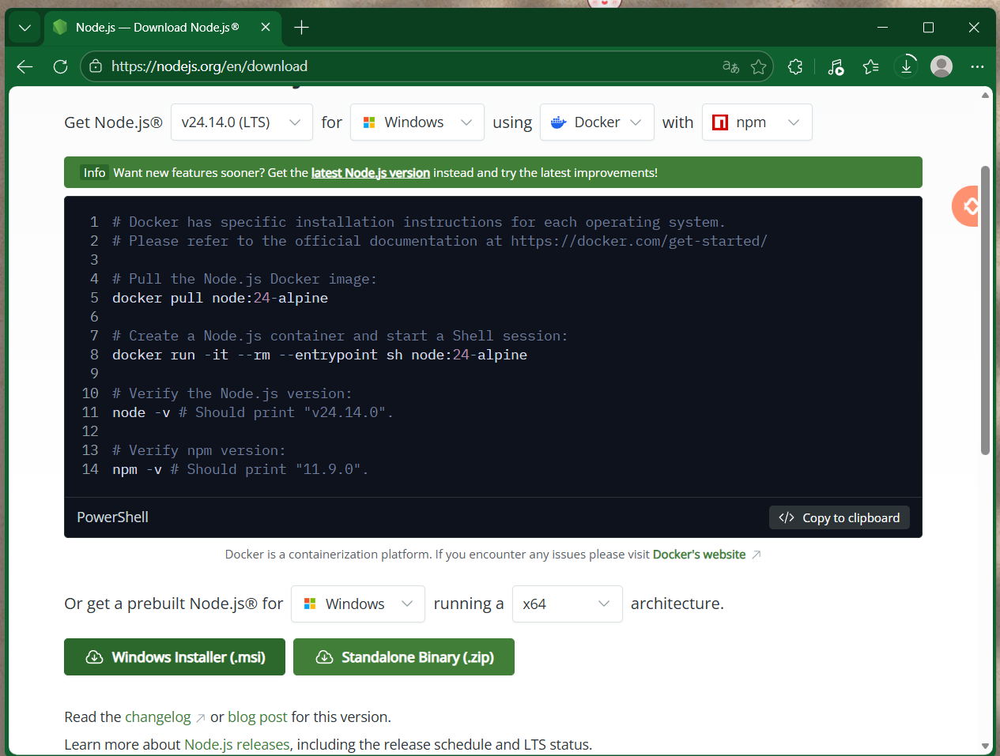

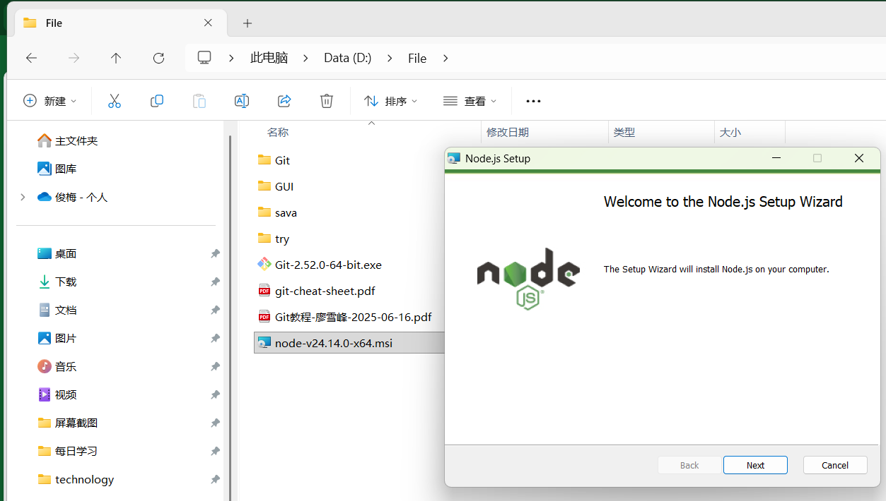

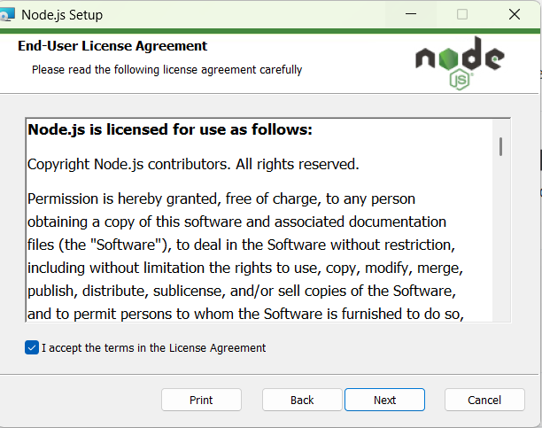

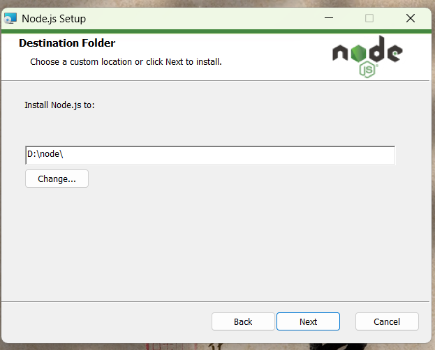

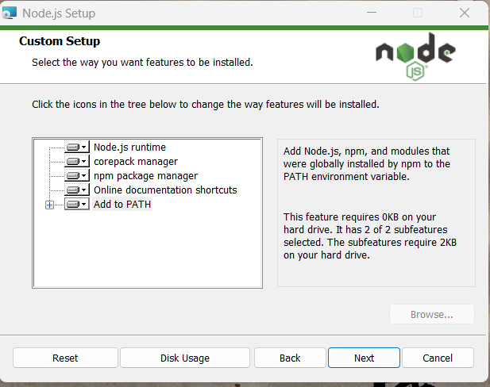

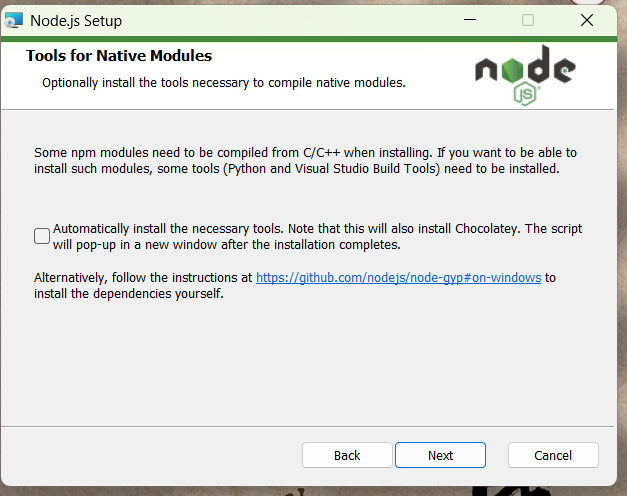

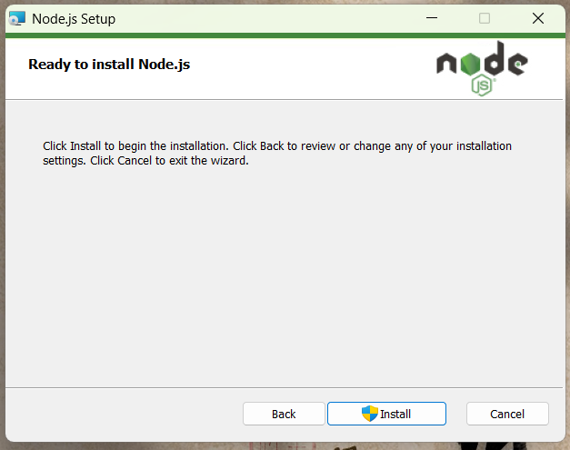

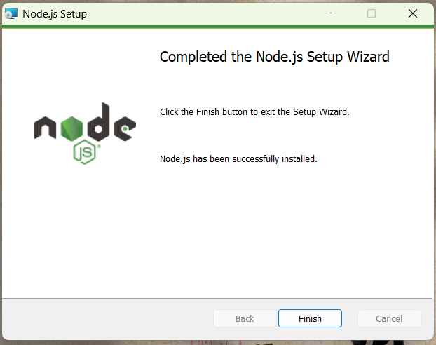

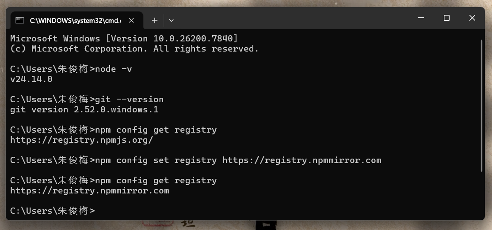

---------

> 知识点

> 1.验证是否安装成功
> &emsp;&emsp;安装完成后，可以打开命令行工具（Windows用户打开CMD或PowerShell，Mac用户打开终端），输入以下命令验证是否安装成功：
> ```bash
> node -v
> git --version
> ```
> 如果显示版本号，说明安装成功了 。


> 2.给npm安装过程“换一条更快的路”
> ```bash
> npm config set registry https://registry.npmmirror.com
> ```
> + 默认源（国外）：服务器在国外，在国内下载依赖包时，速度可能会比较慢，甚至偶尔会失败或超时。
> + 淘宝镜像源（国内）：这是一个完全同步 npm 官方库的国内镜像，由淘宝团队维护。切换之后，下载速度会快很多。
> ```bash
> # 查看当前的镜像源地址
> npm config get registry https://registry.npmjs.org/
> # 修改镜像源地址
> npm config set registry https://registry.npmmirror.com
> # 验证镜像源地址
> npm config get registry https://registry.npmmirror.com
> ```

&emsp;&emsp;对于正在进行的 Hexo 博客搭建，执行这条命令会很有帮助，后续无论是安装 Hexo 还是安装其他插件，都会顺畅不少。

## 本地搭建博客

1. 打开命令行，执行 npm install -g hexo-cli 安装Hexo。
2. 执行 hexo init myblog 创建一个名为 myblog 的博客文件夹。
3. 进入该文件夹 (cd myblog)，执行 npm install 安装依赖。
4. 执行 hexo s，然后在浏览器打开 \http://localhost:4000，你就能在本地看到博客了！

----------

```bash
# 1.安装hexo
npm install -g hexo-cli

# 2.验证hexo，检查版本 
hexo -v

# 3.创建一个文件夹存放博客
$ hexo init myblog
# 这个过程会自动下载Hexo所需的所有文件。

# 4.进入博客目录
cd myblog

# 5.安装博客所需依赖
$ npm install

# 6.本地预览博客
hexo server
# 或
hexo s
# 系统会启动一个本地服务器，打开浏览器访问 http://localhost:4000，你就能看到博客的默认样子了！ 按 Ctrl+C 可以关闭本地服务。
```

---------------

### 一、全局安装Hexo脚手架工具

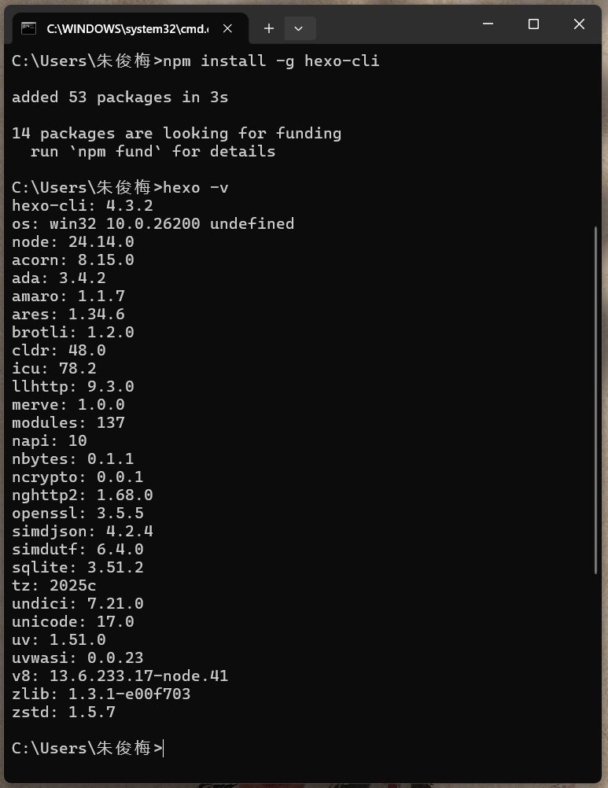

> :memo: 那个 14 packages are looking for funding 的提示可以忽略，它是 npm 的一个公益功能，提示你有些开源项目在寻求资助，不影响使用。

### 二、初始化博客

```bash
# 2.进入博客目录

C:\Users\朱俊梅>D:

D:\>cd today\myblog

# 3.安装博客所需依赖
D:\today\myblog>npm install
npm warn deprecated inflight@1.0.6: This module is not supported, and leaks memory. Do not use it. Check out lru-cache if you want a good and tested way to coalesce async requests by a key value, which is much more comprehensive and powerful.
npm warn deprecated glob@7.2.3: Glob versions prior to v9 are no longer supported
npm warn deprecated abab@2.0.6: Use your platform's native atob() and btoa() methods instead
npm warn deprecated domexception@4.0.0: Use your platform's native DOMException instead
npm warn deprecated cuid@2.1.8: Cuid and other k-sortable and non-cryptographic ids (Ulid, ObjectId, KSUID, all UUIDs) are all insecure. Use @paralleldrive/cuid2 instead.
npm warn deprecated moize@6.1.7: This library has been deprecated in favor of micro-memoize, which as-of version 5 incorporates most of the functionality that this library offers at nearly half the size and better speed.

added 237 packages in 8s

29 packages are looking for funding
  run `npm fund` for details

# 4.本地预览博客
D:\today\myblog>hexo s
INFO  Validating config
INFO  Start processing
INFO  Hexo is running at http://localhost:4000/ . Press Ctrl+C to stop.
```

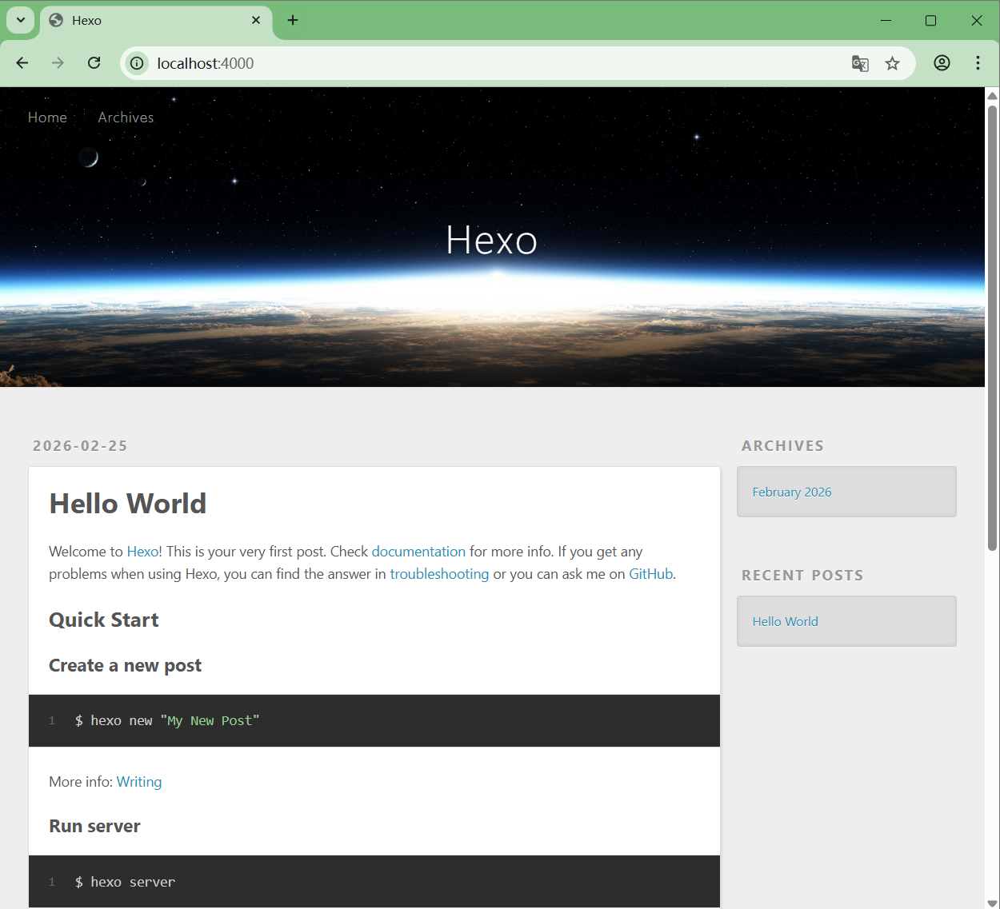

----------

按Ctrl + C

```bash
D:\today\myblog>hexo s
INFO  Validating config
INFO  Start processing
INFO  Hexo is running at http://localhost:4000/ . Press Ctrl+C to stop.
INFO  Good bye

D:\today\myblog>
```

## 部署上线

&emsp;&emsp;要让别人也能访问你的博客，需要把它部署到互联网上。

|托管平台|	优点|	缺点|	适合人群|
|-------|--------|------|----------|
|GitHub Pages|	最经典、文档多、全球CDN加速 |	国内访问速度有时不稳定	|想尝试经典方案的初学者|

部署到GitHub Pages 
1. 创建GitHub仓库：登录GitHub，新建一个仓库，仓库名必须是 你的用户名.github\.io（例如我的GitHub用户名是 Zjm110，仓库名就是 Zjm110\.github.io）。
2. 配置SSH Key（可选但推荐）：为了让本地能免密推送到GitHub，可以配置SSH密钥。
3. 安装部署插件：

```bash
npm install hexo-deployer-git --save
```

4. 修改站点配置文件：打开 _config.yml，找到 deploy 部分，修改为：

```yml
deploy:
  type: git
  repo: git@github.com:你的用户名/你的用户名.github.io.git
  branch: main
```

5. 部署到GitHub：

```bash
hexo clean && hexo g && hexo d
```

&emsp;&emsp;等待几分钟，访问 https:\//你的用户名.github.io 就能看到你的博客了！

整个过程分为清晰的五步，我们逐一操作：

|步骤|	核心操作	|说明|
|---------|--------|-----|
|第一步|	在 GitHub 创建新仓库|	仓库名必须为 \Zjm110.github.io|
|第二步|	准备本地博客源码|	清理并准备好要推送的 Hexo 源码|
|第三步|	配置 GitHub Actions 工作流	|创建关键配置文件，告诉 GitHub 如何自动构建|
|第四步|	推送源码并见证自动化	|将源码推送到 GitHub，触发自动部署|
|第五步|	访问你的在线博客	|在浏览器中查看成果|

### 第一步：在 GitHub 上创建专属仓库

首先，我们需要一个存放博客源码的“家”。
1. 登录你的 GitHub 账号，点击右上角的 “+” 号，选择 “New repository”。
2. 最关键的一步：在 “Repository name” 一栏，必须填写 Zjm110\.github.io（请务必将 Zjm110 替换成你自己的 GitHub 用户名）。这是 GitHub Pages 识别用户网站的固定格式。
3. 仓库状态选择 “Public”（公开），这样 Pages 服务才能免费工作。
4. 建议勾选 “Add a README file”，让仓库初始化更顺利。
5. 确认无误后，点击 “Create repository”。

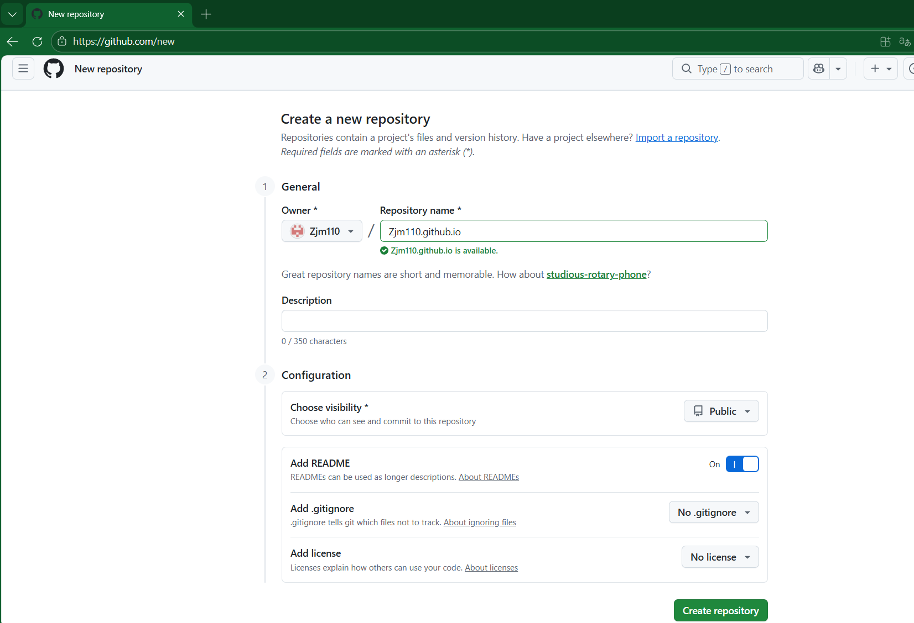

### 第二步：准备本地的 Hexo 博客源码

&emsp;&emsp;在你的电脑上，找到你的 Hexo 博客根目录（例如 D:\today\myblog）。我们需要确保它“干净”且“完整”，可以上传。

&emsp;&emsp;清理无用文件：确保根目录下的 .gitignore 文件中，包含一行 public/。这可以防止我们生成的静态页面被错误地当作源码上传。

&emsp;&emsp;确认 Node.js 版本：打开命令行，输入 node --version 查看你电脑当前的 Node.js 版本，并记下主版本号（例如 v20.x.x）。后面配置会用到。

### 第三步：配置自动化部署的“大脑”—— GitHub Actions

&emsp;&emsp;这是让一切自动化的核心。我们将在本地博客项目中创建一个特殊的文件，告诉 GitHub 如何进行构建。

&emsp;&emsp;创建核心配置文件：在 workflows 文件夹内，创建一个新文件，命名为 **pages.yml**（文件名可自定义，后缀必须是 .yml）。

写入配置代码：将以下代码完整复制进去。

```yml
# .github/workflows/pages.yml
name: Pages

on:
  push:
    branches:
      - main # 监听 main 分支的推送事件

jobs:
  build:
    runs-on: ubuntu-latest
    steps:
      - uses: actions/checkout@v4
      - name: Use Node.js 20 # 将这里的 20 替换为你第一步记下的 Node.js 主版本号
        uses: actions/setup-node@v4
        with:
          node-version: "20" # 例如 "18", "20"
      - name: Cache NPM dependencies
        uses: actions/cache@v4
        with:
          path: node_modules
          key: ${{ runner.OS }}-npm-cache
          restore-keys: |
            ${{ runner.OS }}-npm-cache
      - name: Install Dependencies
        run: npm install
      - name: Build
        run: npm run build
      - name: Upload Pages artifact
        uses: actions/upload-pages-artifact@v3
        with:
          path: ./public

  deploy:
    needs: build
    permissions:
      pages: write
      id-token: write
    environment:
      name: github-pages
      url: ${{ steps.deployment.outputs.page_url }}
    runs-on: ubuntu-latest
    steps:
      - name: Deploy to GitHub Pages
        id: deployment
        uses: actions/deploy-pages@v4
```

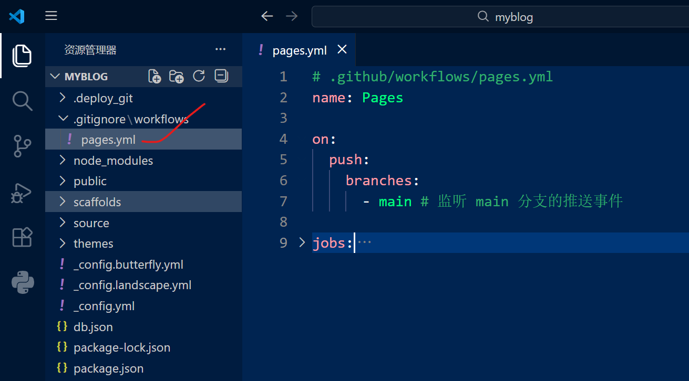

> :memo: 重要修改：请务必将代码中 Use Node.js 步骤里的 node-version: "24" 后面的数字，替换成你刚才记下的 Node.js 主版本号（例如 18 或 24）。

### 第四步：推送源码，启动自动化

&emsp;&emsp;现在，我们只需将本地所有配置好的源码推送到 GitHub，剩下的工作就交给 Actions 了。

&emsp;&emsp;在博客根目录打开命令行，执行以下 Git 命令序列：

```bash
# 1. 初始化本地 Git 仓库（如果之前没做过）
git init

# 2. 将当前目录所有文件添加到暂存区
git add .

# 3. 提交这些文件，创建一个版本
git commit -m "首次提交 Hexo 源码"

# 4. 将本地仓库与你刚创建的 GitHub 仓库关联
#   请将下面的仓库地址替换为你的仓库地址（在仓库主页点击 "Code" 按钮复制 HTTPS 地址）
git remote add origin https://github.com/Zjm110/Zjm110.github.io.git

# 5. 将本地的 main 分支推送到远程仓库
git push -u origin main
```

------

```bash
$ cd D:/today/myblog

$ git add .

$ git commit -m "首次提交Hexo源码"

$ git remote add origin https://github.com/Zjm110/Zjm110.github.io.git

git push -u origin main
```

&emsp;&emsp;推送成功后，打开浏览器，进入 GitHub 仓库页面 (https:\//github.com/Zjm110/Zjm110.github.io)，点击顶部的 “Actions” 标签。应该能看到一个名为 “Pages” 的工作流程正在运行。等待黄色圆点变成绿色的对勾，就表示自动构建和部署成功了。

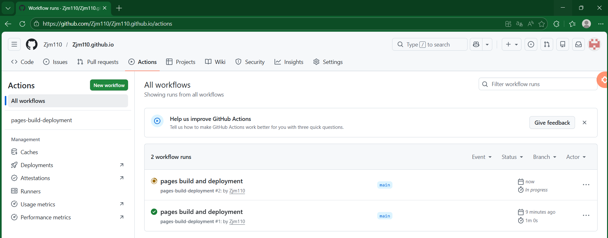

### 第五步：访问我的博客

&emsp;&emsp;打开浏览器，访问 [我的博客](https://Zjm110.github.io)就能看到我的 Hexo 博客了！

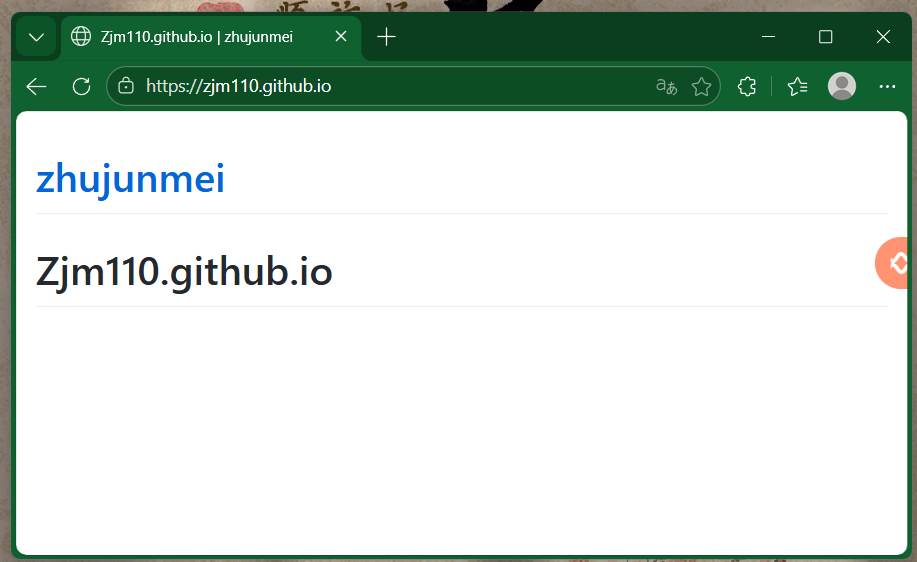

&emsp;&emsp;从此以后这套工作流建立后，博客的更新方式将彻底改变。以后每次写完新文章，只需要在博客根目录下执行三条命令：

```bash
git add .
git commit -m "发布新文章：XXXX"
git push
```

&emsp;&emsp;代码推送到 GitHub 后，Actions 会自动开始构建并部署。无需再手动执行 hexo g 和 hexo d，更不需要像在 Gitee 上那样去手动点“更新”。

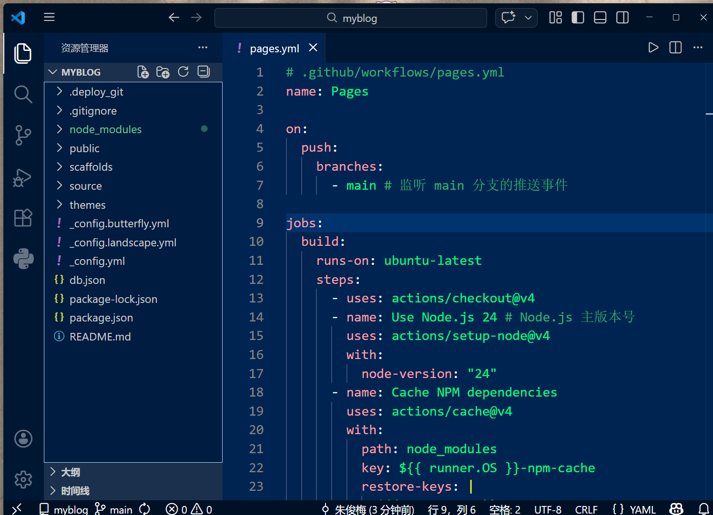